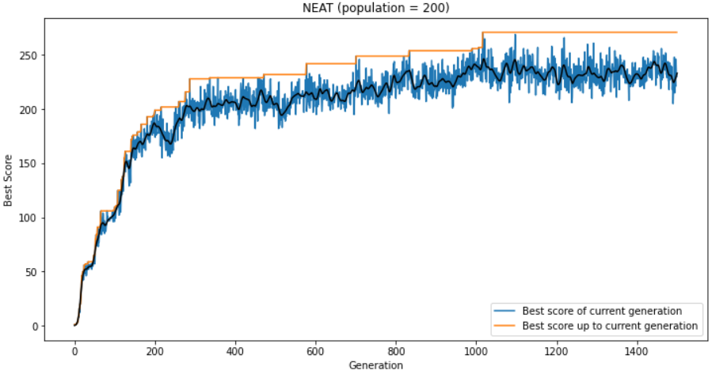
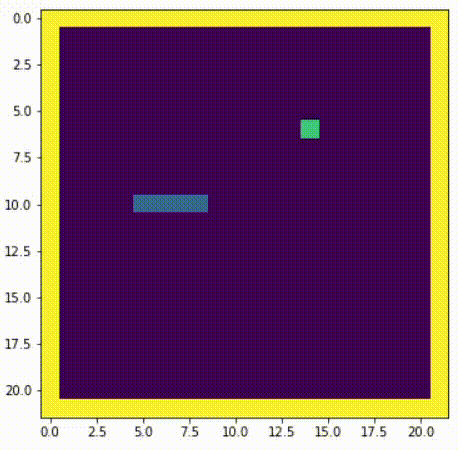
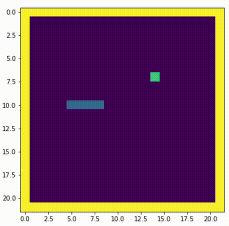

# Snake game AI with Genetic Algorithm (2020.07.17)

## Input & Output
### Input

Distances of wall, food, and snake itself for 8 directions (24 inputs)  
& Previous direction of movement (one-hot encoding, 3 inputs)  
→ Total 27 inputs

### Output
Direction of movement (one-hot encoding for turn left, go straight, turn right)  

## Genetic Algorithm

### Selection: Roulette Wheel  
Every Genome can be a parent for next generation, but probability of becoming a parent is proportial to fitness  
Fitness: $ f(s,m) = 2^s + m + 500s^{2.1} - 0.25s^{1.2}m^{1.3} $  
(REF: https://github.com/Chrispresso/SnakeAI)

### Crossover
  

### Gaussian Mutation
1. Select weight/bias where the mutation will occurs ($w_i$)  
2. For each weight/bias, pick a random value from normal distribution, multiply scale, and add it to weight/bias  
$ w_i <- w_i + scale \times N(0,1) $

### Result

**Score: 118 (Generation: 1788)**  
> Population: 500  
> Selection: Roulette Wheel  
> Crossover: Simulated Binary Crossover 30% + Single Point Binary Crossover 70%  
> Mutation: Gaussian Mutation 5%  

## NEAT (NeuroEvolution of Augmenting Topologies)  
  

### Result

**Score: 271 (Generation: 1017)**  
> Population: 150  
> Initial Connection: unconnected  
> Node add/delete rate: 8.5% / 3.5%  
> Connection add/delete rate: 99% / 15%  
> Weight mutate/replace rate: 45% / 2.5%  
> Bias mutate/replace rate: 5% / 10%  

## vs. Reinforcement Learning  
### Deep Q Network (DQN)  
  
**Score: 100**  

### Proximal Policy Optimization (PPO)  
  
**Score: 132**  
